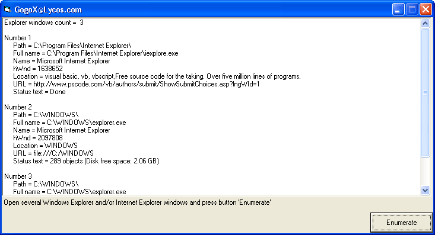



## Enumerate explorer windows

### Description

Enumerates different (internet) explorer windows, show name, path, filename, status text and URL of each window
 
### More Info
 

             |
---                |---
**Submitted On**   |2003-11-27 17:34:02
**By**             |[Georgi Yordanov Ganchev](https://github.com/Planet-Source-Code/PSCIndex/blob/master/ByAuthor/georgi-yordanov-ganchev.md)
**Level**          |Intermediate
**User Rating**    |5.0 (10 globes from 2 users)
**Compatibility**  |VB 5\.0, VB 6\.0
**Category**       |[Internet/ HTML](https://github.com/Planet-Source-Code/PSCIndex/blob/master/ByCategory/internet-html__1-34.md)
**World**          |[Visual Basic](https://github.com/Planet-Source-Code/PSCIndex/blob/master/ByWorld/visual-basic.md)
**Archive File**   |[Enumerate\_16769611272003\.zip](https://github.com/Planet-Source-Code/georgi-yordanov-ganchev-enumerate-explorer-windows__1-50156/archive/master.zip)

